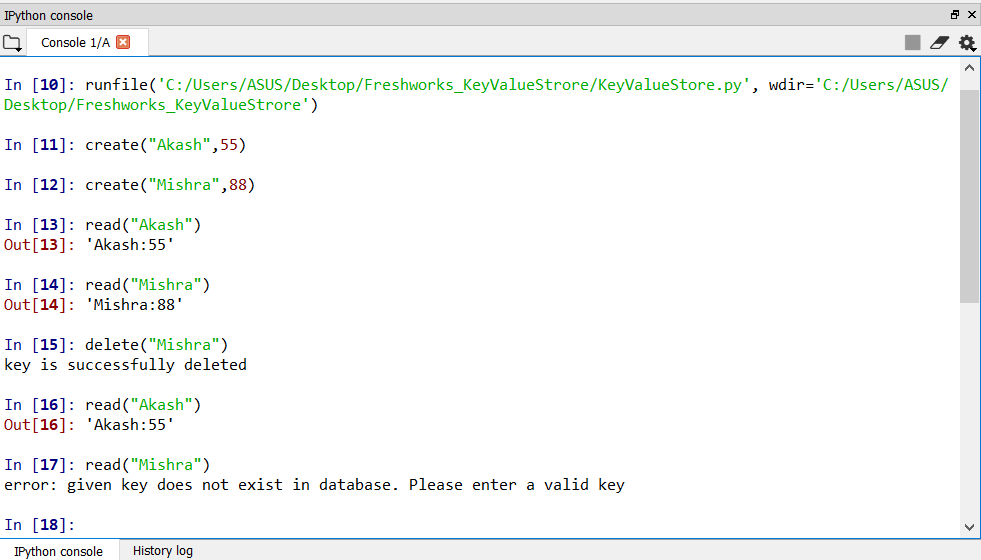

# Key-Value Datastore
## Description
This is a file-based key-value data store that supports the basic CRD (create, read, and delete) operations.

The data store supports following functional requirements.

1) The key is always a string - capped at 32chars. The value is always a JSON object - capped at 16KB.

2) A new key-value pair can be added to the data store using the Create operation.

-> for create operation use syntax "create(key_name,value,timeout_value)" or "create(key_name,value)"

3) A Read operation on a key can be performed by providing the key, and receiving the value in response, as a JSON object.

-> for read operation use syntax "read(key_name)"

4) A Delete operation can be performed by providing the key.

-> for delete operation use syntax "delete(key_name)"

## Testing

